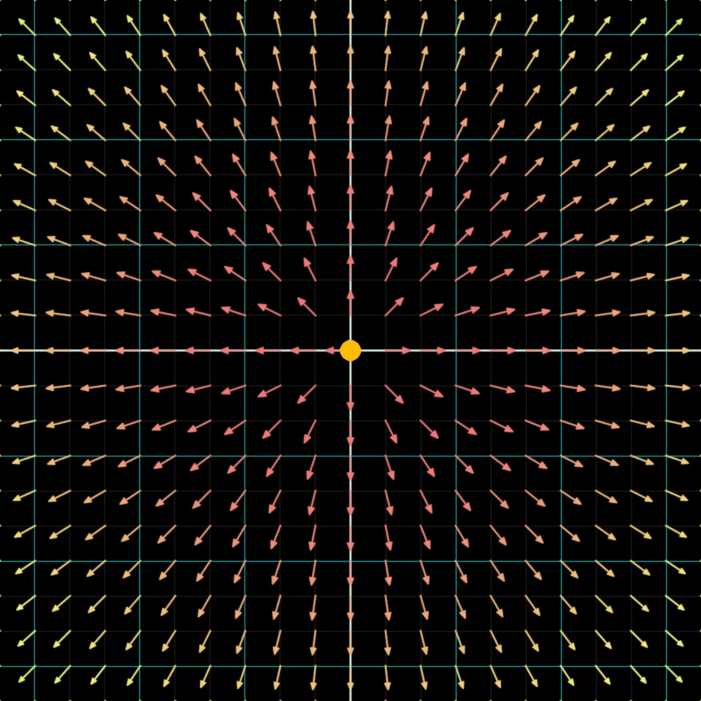
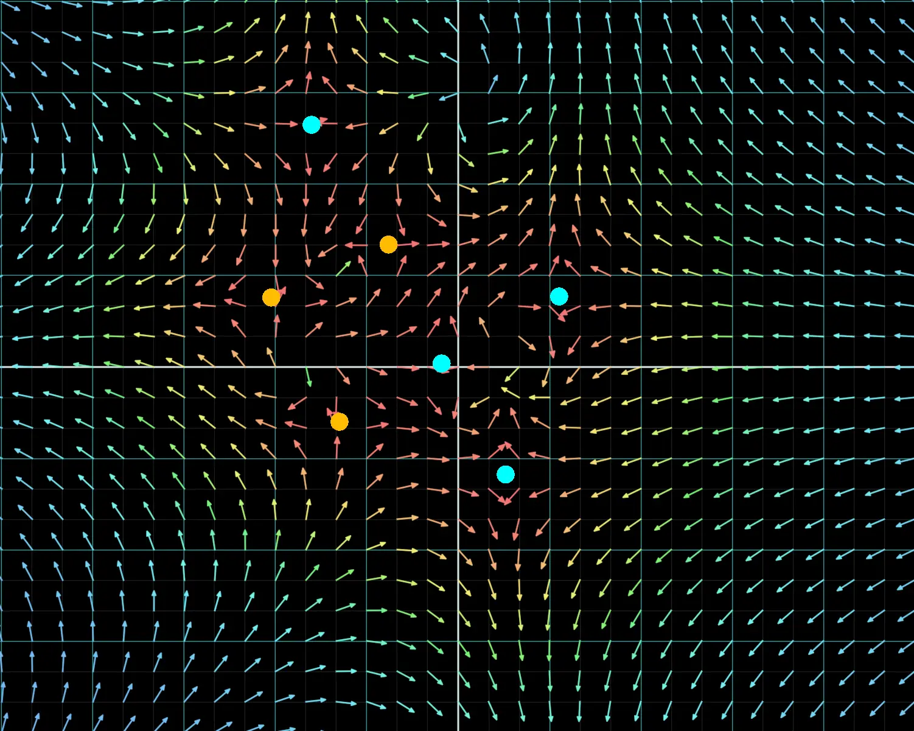
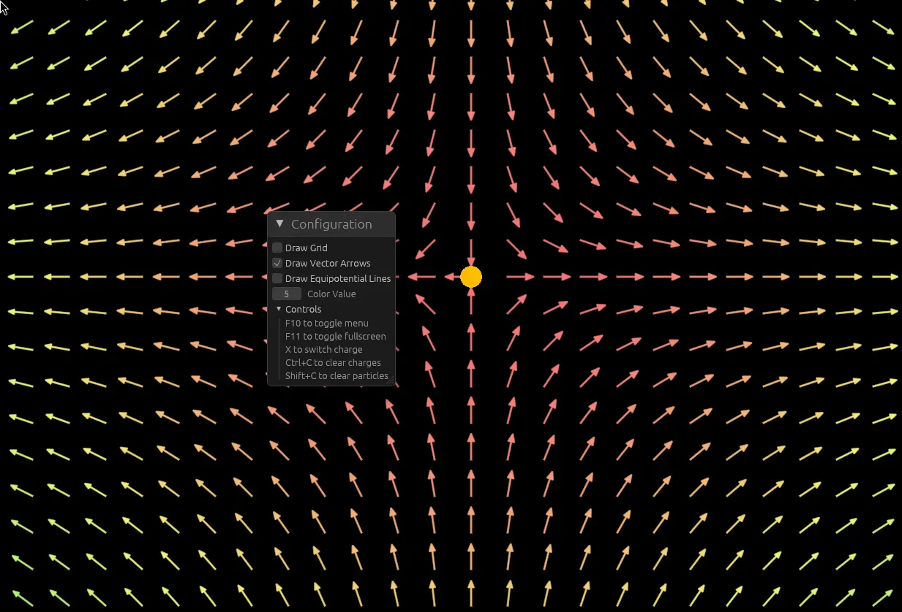

# Introduction

Now that we have succesfully converted to using `rust-gpu` and shaders for our simulations, lets look at new examples and ideas that we could not do before.
In this section we will look at the simulation and application of Coulomb's Law on electrostatic charges.

# Electrostatics and the Coulombs Law

In contrast to normal electromagnetism, the study of electrostatics involves charges, electric and magnetic fieds that dont alternate over time,
hence the suffix statics. This means that the 4 Maxwell's equations simplfy to:

$$
\begin{aligned}
\vec{\nabla} \cdot \vec{E} &= \frac{\rho}{\epsilon_0} \\
\vec{\nabla} \cdot \vec{B} &= 0 \\
\vec{\nabla} \times \vec{E} &= 0 \\
\vec{\nabla} \times \vec{B} &= \frac{\vec{j}}{\epsilon_0}
\end{aligned}
$$

What this means in practice is that it is much easier to compute and deal with charges that are not moving.
Let us focus on the Coulombs Law now. The Coulomb law talks about the force on exerted on two charges, and is equal to the following expression.

$$
\vec{F_1} = \frac{1}{4\pi \epsilon_0} \, \frac{q_1 \, q_2}{r^2_{12}} \, \hat{e_{12}} = -\vec{F_2}
$$

Where $\hat{e_{12}}$ represents the unit vector from $q_1$ to $q_2$. An electric field is defined as the force per unit charge, therefore if we take $q_1$ as the reference, the electric field becomes:

$$
\vec{E} = \frac{1}{4\pi \epsilon_0} \, \frac{q_2}{r^2_{12}} \, \hat{e_{12}}
$$

This electric field can also be generalised for containing multiple charges, where we simply iterate over every charge.

$$
\vec{E} = \frac{1}{4\pi \epsilon_0} \, \sum_j \frac{q_j}{r^2_{1j}} \, \hat{e_{1j}}
$$

However, we can define the electric field in terms of a scalar value, the electric potential. This is usually prefered since you will only have to compute a single
scalar value instead of multiple separate directions. The electric potential is defined as

$$
\phi = \frac{1}{4\pi \epsilon_0} \, \sum_j \frac{q_j}{r_j}
$$

and the negative gradient of $\phi$ relates directly to the electric field.

$$
\vec{E} = - \vec{\nabla} \phi
$$

# Project

There is another way of calculating $\phi$ which involves electric density at every point, however this will force us to loop through every single pixel for every pixel we check,
which raises the complexity of the algorithm up to $O(N^2)$. Therefore, first of all we create a new buffer which hold all the charges currently present in the system. This buffer can
then be modified to dynamically add or remove charges. Afterwards, a compute shader is called which uses this buffer of charges to initialise data inside the potential buffer.
However, we need to represent the whole two dimensional grid, why and how are we not using a texture instead?

Well, textures are generaly really useful and are highly efficient because most modern GPUs have built in cache modules for handling textures, as well textures being able to provide direct UV coordinates to work with,
they are usually prefered. For this use case although, we have a chain of multiple compute shaders, hence it will be a pain using `rust-gpu`s `Image!()` macros and handle the read-write permissions across 3 different layouts.
Therefore, we will resort back to buffers. To represent a two dimensional plane in a single buffer, we will convert the current pixel coordinates into the index by basically getting the pixel number if we were to start
counting from top left and wrapped around everytime we reached the end. The formula for the index could also be represented with this equation:

$$
i = x_{px} + y_{px} \cdot w_{px}
$$

where $w_px$ is the width of the screen and $x_px, y_px$ are the current pixel positions from the top left corner in pixels.
After we have calculated the electrical potential for every pixel and stored it inside the buffer, we can then use that buffer in a second compute shader which will actually convert the potential to a field.
The result is then used in particle and grid shader to correctly orrient the arrows and make 'test charges' (our particles) move through the electric field.

## Electric Potential

For every new module of my program, such as particles, or electrostatics in this case, we create a new `Manager` and a new `Pipeline`. The `Manager` struct is responsible for creating, holding and managing
various states this new system requires. This includes buffers, bind groups and any other flags, such as output during 'ping-ponging'. Following the example we define this new `ElectricManager` as follows:

```rs
pub struct ElectricManager {
    pub charges: Vec<Charge>,
    pub electric_storage_buffers: ElectricStorageBuffers,
    pub electric_bind_groups: ElectricBindGroups,
    pub size: PhysicalSize<u32>,
    pub buffer_size: u64,
    pub next_charge: f32,
}
```

The charges vector (or a dynamic array as you may call it) will hold the position and charge of our charged particles. The buffers will hold the 3 buffers responsible for charges, potential field and the electric field.
Using buffers allows us to index into the correct slot and change data dynamically, such adding or removing charges from our system. Bind groups are just layouts that represent what data we will be passing into the shaders,
they remain static. The `size` referers to the `PhysicalSize` that our screen takes up, meaning the width and height in pixels, this is important to create `buffer_size`, which taken from the name limits the size of each buffer,
making sure we use only whats needed. Finally, `next_charge`, although the naming convention _is_ weird here, just indicates the charge on the next particle to be created. Later, this will used to alternate between positive and negative charges.

Now, how do we use this data to actually create our electric potential. Firstly, a buffer is created, and the vector of initial charges is initialised into it. This buffer gets passed onto our first comptue shader,
`electric_potential_cs`. This compute shader will be ran for every pixel on our screen and will directly use the formula discussed earlier to calculate the potential at any point. Therefore, a for loop through each particle is created,
which calculates the distance from each pixel to that charge, then sums it all up together and multiplies by a constant defined in the real life as $\frac{1}{4\pi\epsilon_0}$. However, it is important to note that the value
for $\epsilon_0$ is chosen not based on realism, but to fit the simulation look.

```rs
// Runs in 16x16 groups
#[spirv(compute(threads(16, 16), entry_point_name = "electric_potential_cs"))]
pub fn electric_potential_cs(
    // Get global index
    #[spirv(global_invocation_id)] global_invocation_id: UVec3,
    #[spirv(descriptor_set = 0, binding = 0, storage_buffer)] constants: &ShaderConstants,
    // Buffer of charges
    #[spirv(descriptor_set = 1, binding = 0, storage_buffer)] charges: &[Charge],
    // Buffer we will write to
    #[spirv(descriptor_set = 1, binding = 1, storage_buffer)] electric_potential: &mut [f32],
) {
    // Use our equation mentioned previously to convert to index.
    let x = global_invocation_id.x as usize;
    let y = global_invocation_id.y as usize;
    let index = x + y * constants.width as usize;

    // Check if we are outside the screen
    if x >= constants.width as usize || y >= constants.height as usize {
        return;
    }

    // Create a total variable
    let current_coords = Vec2::new(x as f32, y as f32);
    let mut potential = 0.0;

    let k = 1.0 / (4.0 * PI * constants.epsilon_naught);

    // Summation of all charges
    for charge in 0..constants.num_charges {
        // Extract charge
        let charge = charges[charge as usize];
        let charge_pos = charge.position;
        let charge_coords = Vec2::new(charge_pos[0], charge_pos[1]);

        let q = charge.charge;
        let r_sq = (current_coords - charge_coords).length_squared();
        // Usually potential is q / r, however for simulation purposes so that test charges dont
        // explode, we will use q / sqrt(r^2 + epsilon^2).
        // Note, this EPSILON_SQ is NOT correlated to epsilon_0, but is a smoothening factor around 1.0
        potential += q / (r_sq + EPSILON_SQ).sqrt();
    }

    let final_potential = potential * k;

    // Write back to correct index.
    electric_potential[index] = final_potential;
}
```

## Electric Field

Now that we have acquired the electric potential buffer, we can use it directly in our second compute shader to generate the electric field iteself, as specified by $\vec{E} = -\vec{\nabla}\phi$.
But wait a minute, how do we even do partial derivatives inside of computer science? Well, since we cannot acquire the analytical solution before hand, we have to rely on sampling, more specifically the central difference method.

The central difference method can approximate the derivate of any funciton by taking multiple samples around a point, or in our case a pixel. The equation for this approximation will look as follows, where $h$ is a tiny step, e.g. 1 pixel.

$$
f'(x) \approx \frac{f(x+h) - f(x-h)}{2h}
$$

Now, if this operation is repeated in each direction, meaning horizontal and vertical, we will acquire the approximation for our $\partial \phi / \partial x$ and $\partial \phi / \partial y$.

```rs
#[spirv(compute(threads(16, 16), entry_point_name = "electric_field_cs"))]
pub fn electric_field_cs(
    // Inputs
) {
    // ...Extract index and check if within range
    // First we calculate the coordinates and THEN the indices.
    let left_x = (x - H).max(0);
    let right_x = (x + H).min(constants.width as i32 - 1);

    // Since we are centered around top left, the `-` will bring us up and `+` will bring us down.
    let up_y = (y - H).max(0);
    let down_y = (y + H).min(constants.height as i32 - 1);

    let left_sample = electric_potential[(left_x + y * constants.width as i32) as usize];
    let right_sample = electric_potential[(right_x + y * constants.width as i32) as usize];

    let up_sample = electric_potential[(x + up_y * constants.width as i32) as usize];
    let down_sample = electric_potential[(x + down_y * constants.width as i32) as usize];

    let d_dx = (right_sample - left_sample) / (2.0 * H as f32);
    let d_dy = (up_sample - down_sample) / (2.0 * H as f32);

    let field = Field {
        field: [-d_dx, -d_dy],
        _pad: [0.0; 2],
    };

    electric_field[index as usize] = field
}
```

When we multiply `H * constants.width`, we are basically forcing to wrap `H` times around, which progresses us downwards.
Now that we are succesfully calculating $-\vec{\nabla}\phi$ and storing it inside of `electric_field` buffer, we can actually apply it onto our grid.
Hence, we will have to pass in this electric bind group into the fragment shader for our grid. It is important to note the order of operations, since we will be working with multiple
compute and render passes:

1. First compute pass calculates `electric_potential` from a list of charges.
2. Second compute pass calculates `electric_field` from `electric_potential`, as well as pass in updated data into `particle_cs`.
3. Main render pass will pass in all data into vertex and fragment shaders for the grid.

To apply the `electric_field` inside of the fragment shader, we use the index calculation mentioned earlier and the `frag_coords` passed in. Then, from the extracted position we
can create the vector and make the arrows point in the correct direction. However, currently the arrows will be bending around invisible objects, thefore we can copy how particles are rendered and apply
same vertex shader code onto the charges themselves but slightly editting the properties like the radius. Since for each charge we also store its relative charge (-1 / +1), we can shade each one of them differently,
where I have went for an orangy-yellow as my positive and a cool blue for negatives. Here is the final output when you combine all the techniques together.

<div class="img-container">
  
</div>

Now this is very exciting that we can see the electric field in action, but it is not quite dynamic enough, therefore we need to introduce user input. From an already existing `Mouse` struct we can extract
when user uses right click and insert a new charge into `Vec<Charge>`, which is stored in the `ElectricManager`. In addition to that, we alter the charges buffer and the new charge appears in our simulation.
In contrast to normal particles, here we could entirelly replace and recreate the buffer with all the charges, since none of their information dynamically updates inside of GPU, nothing would be lost.
However, it is still quite more efficient to index into the right spot and edit a specific memory location. Now that we have introduces spawning in new charges, we will have to look at a way of switching their charge.
I have decided this should be done by a keyboard input, for example when user presses `X` on their keyboard.

## Keyboard Inputs

This means we have to properly look at how we want to handle keyboard inputs. Well, first of all an input from a device is a window event coming from `winit` itself, and we handle all of them inside of the `State` struct.
When check that this window event is a keyboard input, we can pass in the key and its state into a new struct, `Keyboard`. This struct will update a HashMap that is stored inside of it assignign the key to a specific state.
This way we can track inside and outside of the struct when a specific key is pressed down.

```rs
WindowEvent::KeyboardInput { event, .. } => {
    self.keyboard.update_key(event.physical_key, event.state);

    let input_actions = self
        .keyboard
        .get_input_actions(event.physical_key, event.state);

    self.handle_input_actions(input_actions);
}
```

In addition to that, we pass in the event information into `get_input_actions`. This method is what is actually responsible
for processing user input and applying correct states, but not in a way you think it does. Instead of this method being responsible for acting upon the user input,
it will only return a struct showing the states that have been changed. This allows the method to solely be responsible for configuring what keys trigger what inputs.

```rs
#[derive(Default, Debug, Clone, Copy)]
pub struct InputActions {
    pub increment_color: bool,
    pub increment_color_fast: bool,
    pub decrement_color: bool,
    pub decrement_color_fast: bool,
    pub remove_particles: bool,
    pub remove_charges: bool,
    pub toggle_fullscreen: bool,
    pub toggle_charge: bool,
    pub toggle_ui: bool,
}
```

This struct is then passed onto the `handle_input_actions` shown earier, which acts upon these states to perform the actions shown. Now that keyboard inputs are handled properly we can create a variety of different
electric fields.

<div class="img-container">
  
</div>

## GUI Interface

In addition to creating an electric field visualiser, I wanted to focus on showing equipotential lines as well as field lines. However, this would seriously interfere with our infrastrcture, since code will have to be removed and replaced.
Hence, not to create many copies, all of my sub-projects will work in the same program and always be active, but not always displayed. This means we need to somehow activly toggle on or off certain parts of shaders.
A graphical user interface (GUI) would be quite helpful, and luckily enough I already had prior experience working with once, specifically for `wgpu`. The [`egui`](https://github.com/emilk/egui) library is a fantastic and
as advertised an easy to use GUI interface creator. This library greatly simplifies alot of mess to deal with. From my previous attempts, I have learnt that its best to create a new `UIManager` struct which will hold
appropriate method for intialisation, resize and draw calls.

Although the init process is not as simple as it may seem, I will do my best to explain briefly the flow of data within this struct. On program intialisation, we create a new `UIManager` that will be persistant and
store its state, renderer and other attributes. On each redraw call, before the render pass even starts we have to prepare the UI. This step includes acquiring the raw input and drawing a predefined UI layout onto an output.
This output is then processed inside of the renderer using textures and in the end `ClippedPrimitive`s are produced. We store them inside the struct and update needed buffers. After this preparation stage, the render pass continues as normal,
where at the end we call the `draw` on the manager. This method will use the previously stored clipped primitives to render the UI elements onto the screen.

Lets look at how the UI layout is created. As mentioned previously this library is quite intuitive, and all the methods are straightforward as seen here:

```rs
egui::Window::new("Configuration")
    .collapsible(true)
    .resizable(true)
    .default_width(400.0)
    .show(ctx, |ui| {
        egui::ScrollArea::vertical().show(ui, |ui| {
            ui.vertical(|ui| {
                ui.checkbox(&mut self.input_values.draw_grid, "Draw Grid");
                ui.checkbox(&mut self.input_values.draw_vec, "Draw Vector Arrows");
                ui.checkbox(
                    &mut self.input_values.draw_potential,
                    "Draw Equipotential Lines",
                );
            });
        });
    });
```

Here in this example we create three checkboxes for our render outputs. On user input `egui` will capture it and update the `&mut self.input_values.draw_grid` variables. This `input_values` field is a persistant field which is used specifically for the UI.
This field is then read from inside of `State` and passed on in the shader struct to render appropriate elements. Here is how it looks populated with more inputs.

<div class="img-container">
  
</div>

## Equipotential & field lines

In the Feynman lecture covered, the idea of equipotential and field lines were covered. An equipotential line was defined as a line segment,
along which the electric potential, $\phi$ is constant. Field lines, however, are more complex. They are always perpendicular to the electric potential,
and flow from positive to negative charges. They are usually evenly spaced out, so their density remains constant throughout the simulation.
These field lines are useful since they trace out the path, the trajectory, of a particle if it were to be released in the system.

We can achieve the same effect using shaders. Inside the grid fragment shader we can use the coordinates of our pixel as an index and extract
the relevant item from our electric potential buffer. We can then calculate the diffrenece between our current potential and the target potential, this will be used
as our difference in the `antialias` function. To get multiple lines showing up instead of a single target, we can do a simple for loop and step through the
targeted potentials, and merge the output from all of them.

However, creating the field lines is more complicated than it sounds. For this simulation we will trace the position of particles as they move through the field,
and then use those points to draw an outline. This means that density will not remain constant throughout the field, however this method is much simpler
and will simplify the process. Therefore, for each positive charge on the screen (not negative since they consume particles), we will create $N$ number of
particles spaced out equally around the charge. Then, we can loop $T$ time steps forward and progress each particle according the field and its current position.
On each step we will sample its current location and store it inside another buffer. The indexing for this new buffer will work as following:

$$
i = (i_{\text{charge}} \cdot N + i_{\text{particle}}) \cdot W_{\text{max}} + \text{step}
$$
