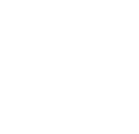
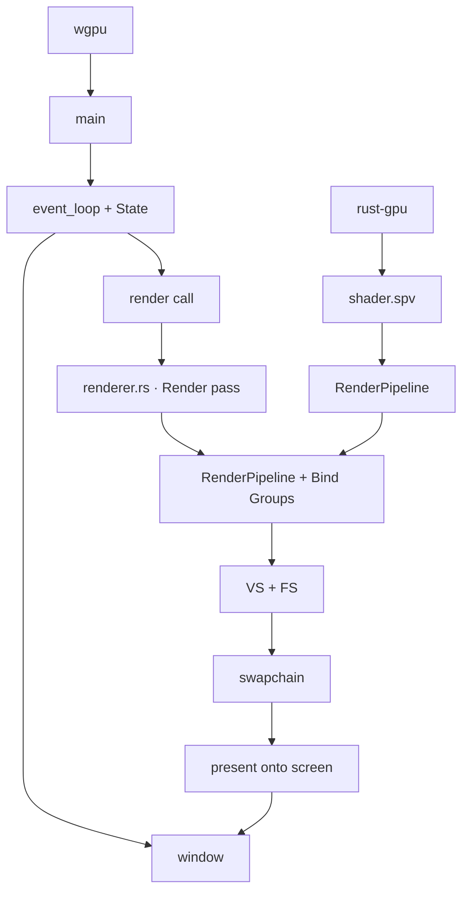
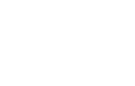
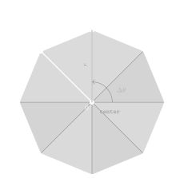

# Introduction

As mentioned in the previous chapter, I want to work more extensively on more complex topics and ideas.
However, I was heavily limited since all my calculations were done on the CPU.
I did not feel like extending using [Nannou](https://nannou.cc/) and its [wgpu](https://wgpu.rs/) API, therefore I decided to go with a cleaner option.
There exists a library, originally developed by [Embark](https://www.embark-studios.com/) (<3), called [rust-gpu](https://rust-gpu.github.io/).
This library allows us to write shader code directly using rust and its range of amazing systems.
In this section I will cover how I was able to transition to using shaders to render my simulation more efficiently, as well as re-creating the electric field by applying Coulomb's Law.

# Shaders

What even are shaders? Well, to understand what shaders truly are and how we use them, lets first look at how the GPU renders our data.
Any model or shape, be it 3D or 2D is made up of fragments.
Each of these tiny fragments is basically a triangle, consisting of 3 vertices arranged in a counter clockwise manner to form that surface.
These fragments are then rasterized to form pixels which are rendered onto your screen.

<div class="svg-container">
  
</div>

We can easily manipulate these fragments and vertices to produce complex shapes and colors using shaders. A shader in principle is just code that is run on the GPU.
There are mainly 3 types of shaders:

- **Vertex Shader**: Responsible for drawing or manipulating the individual vertices.
- **Fragment Shader**: Responsible for coloring in and assigning a color to an individual fragment.
- **Compute Shader**: Splits up complex computations into workgroups and works on them in parallel.

Shaders work differently from normal processes and calculations done on the CPU.
For example, shaders are not able to have sequential instructions that are executed once, like draw a line from point $A$ to point $B$.
Instead, the shader runs the same code for _every_ pixel, meaning all functions and all calculations have to be generalised to work on any individual element.
In this specific case, by using vectors and algebra, we can work out the shortest distance from any pixel to a line segment, and then use that to decide if we have to display something.

## Coordinate System

When using Nannou, it was really easy to work with its coordinate system, since there was only 1 single global method of defining coordinates,
where a scale was chosen centered around the origin. Here, there are multiple different coordinate systems, such as:

- **Normal Device Coordinates (NDC)**: What most GPUs understand natively, $(0,0)$ being the middle of screen, and range for $x$ & $y$ spanning $[-1.0, 1.0]$, while $z$ $[0.0, 1.0]$.
- **Clip Space**: The vertex shader will output this type of coordinate, being a `vec4<f32>(x,y,z,w)`. Where $w$ is used to give perspective to objects, like depth. Usually this system gets converted directly to NDC.
- **Screen Space**: Most of the time this uses real pixel values to denote physical dimensions on your screen, $(0, 0)$ being top-left corner, commonly used in fragment shaders. Has also an additional $0.5$ pixel displacement to account for the center of each pixel.
- **UV Mapping**: Used for mapping textures onto geometry, centered in top-left corner, having a range of $[0.0,1.0]$. Where $U$ is increasing rightwards and $V$ decreases downwards.

In summary, inside the vertex shader we will be getting our **Clip Space** coordinates, doing calculations on them and outputting an **NDC**.
Then, inside our fragment shader we will receive **Screen Space**, which gets mapped to a color.

# Data flow

Now, lets talk about the data flow within our whole application. At the very beginning, we first have to compile and convert the rust shader code into an `.spv` file.
Afterwards, the main `wgpu` application is initialised. In the `main` function the `event_loop` and `State` is created.
The `event_loop` is responsible for passing on events from the window to the application, such as draw calls and keyboard inputs.
The `State` struct is responsible for retaining all the data in our application, it will hold all essential components that make up the system.
Afterwards, we create a new window using `winit` which will act as our canvas.
Now, on every draw/redraw call received from the event loop, we will call the `render.rs` first.
This `renderer` is responsible for creating and orchestrating render passes. For each pass, render pipelines and bind groups are linked.
A render pipeline outlines the configuration and the architecture of data that is being passed into the shaders, while bind groups represent the data itself.
Each bind group can hold multiple pieces of data, like a storage buffer, or a texture or really anything.
After that, the vertex and fragment shaders do their job at computing position of vertices and the color of the fragments, which will give an output that we can present onto the window.
Below is a detailed diagram outlining this very process.



However, not to overload this page with extreme details, this is the only section where we will mention such a large hierarchy. In most cases, I will use simpler and more individual examples of problems that I had to solve and overcome, as well as interesting techniques used. However, it is still quite important to understand the general outline.

# Signed Distance Fields

The previously mentioned case of drawing a line from one point to the other is a common example of the use of a Signed Distance Field (SDF).
An SDF works by calculating the distance from any point on the screen to an object, be it a line, a rectangle or a circle.
This technique also extends into 3 dimensions, however this whole blog will mainly focus on working in 2D.
Now, we will look at how a few common SDFs are derived, calculated and applied in my recreation.
Lets take a look at the most simple example, a line segment. Imagine two points on a 2 dimensional grid, $A$ and $B$, which are connected by a line segment - denote this vector $\vec{AB}$.
Now, take a random point $P$ somewhere around the line segment, as shown in the illustration.
If a line of shortest distance (perpendicular to $\vec{AB}$) is drawn, the point at which it intersects with the original vector $\vec{AB}$ is labelled point $Q$.
Hence, we can construct the vector $\vec{AP}$ as shown in the image.

<div class="svg-container">
  
</div>

After, we can label the distance from $A$ to $Q$ as $h$.
By finding the ratio of $h$ we can determine how far we are along the vector $\vec{AB}$ we are, which will give us all the information we need to find $d$, the distance $\vec{PQ}$.
We can actually get $h$ quite easily, by taking the dot product $\vec{AP} \cdot \vec{AB}$, we can get the scalar value that the vector $\vec{AP}$ aligns with $\vec{AB}$.
After that, a normalisation has to be applied, yielding us:

$$
h = \frac{\vec{AB} \cdot \vec{AP}}{|\vec{AB}|^2}
$$

However, we can simplify the denominator even further by utilising the dot product of $\vec{AB}$ and itself.

$$
\begin{aligned}
  |\vec{AB}|   &= \sqrt{x^2 + y^2} \\[4pt]
  |\vec{AB}|^2 &= x^2 + y^2
\end{aligned}
\qquad\qquad
\begin{aligned}
  \vec{AB} \cdot \vec{AB} &= x \cdot x + y \cdot y \\[4pt]
                          &= x^2 + y^2
\end{aligned}
$$

This yields us the same result, however computationally taking the dot product is much faster than square roots.
After we have acquired $h$, we can calculate the vector $\vec{PQ}$. And by taking the length of that vector, we acquire our final distance $d$.

$$
\begin{aligned}
\vec{PQ} &= -\vec{AP} + h \cdot \vec{AB} \\
d &= |\vec{PQ}|
\end{aligned}
$$

When this mathematics is converted to rust, we can acquire the following function:

```rs
pub fn sdf_line(a_pos: Vec2, b_pos: Vec2, p_pos: Vec2) -> f32 {
  let ab_vec = b_pos - a_pos;
  let ap_vec = p_pos - a_pos;

  // Make sure the denominator is not 0
  let h = ab_vec.dot(ap_vec) / ab_vec.dot(ab_vec).max(0.001);
  let h_clamped = h.clamp(0.0, 1.0);

  (ap_vec - h_clamped * ab_vec).length()
}
```

But how can we apply this SDF? After extracting the distance to a line, or some object, we can pass the distance and the thickness into the `antialias` function.
This antialias function will use `smoothstep` to non-linearly increase the alpha value as distance gets closer to the thickness.
Then we use this alpha value to interpolate between a certain color.
This way by calculating the distance from any object, we can get the correct alpha and hence color in any pixel appropriately, giving us smooth blurred edges.

# Replicating the application

Now let us focus on re-creating all the features currently present inside our old Nannou simulation before we start adding new things.
This will hopefully make the general architecture of the program more clear.

## Creating the background grid

Let us recreate the grid seen in the background using shaders now. Since this is going to be a background shader, we don't need to pass in many vertices to render on, we just have to cover the whole screen.
This can be achieved by using bitwise manipulation to translate the vertices to the right position as shown here:

```rs
// A vertex shader entry point is created
#[spirv(vertex(entry_point_name = "grid_vs"))]
pub fn grid_vs(
  // We accept current vertex id
  #[spirv(vertex_index)] vert_id: i32,
  // This is the parameter we have to modify and output, since 'mut'
  #[spirv(position)] vtx_pos: &mut Vec4
  ) {
    // We use left logical shifts (<<) and bitmasking (&)
    // to convert the vertices id's to appropriate UV coordinates.
    // The output will be (0.0, 0.0), (2.0, 0.0), (0.0, 2.0)
    // Which corresponds to top left, far right and far downwards.
    let uv = Vec2::new(((vert_id << 1) & 2) as f32, (vert_id & 2) as f32);
    // ...
}
```

However, this is the **UV** coordinates, we have to convert them to **NDC** coordinate system. This can be achieved by applying the following operation:

```rs
// (x*2 - 1, y*2 - 1)
let pos = Vec2::new(uv.x * 2.0 - 1.0, uv.y * 2.0 - 1.0);
// Since we need it to be a Vec4, we add the missing data.
// And use a pointer to modify the output value.
*vtx_pos = pos.extend(0.0).extend(1.0);
```

Now that we have a fragment to draw on, we can draw the lines which will cover the entire screen.
We have multiple lines to draw, the axis line (bright white lines along the origin), the grid lines (white lines repeating every N pixels) and highlight lines (colored lines repeating every N grid lines).
This can be done using signed distance fields.
First, to draw the axis lines, if we have centered our coordinates beforehand, we can directly use them to get the closest distance as shown here:

```rs
let axis_distance = px_x.abs().min(px_y.abs());
let axis_alpha = antialias(axis_distance, GRID_THICKNESS_PX);
```

Lets talk about grid lines and highlight lines. For both we first have to calculate the distance to the closest line.
This line can be acquired by checking how many times our position can fully wrap into a preset `GRID_SPACING_PX`.
This is done using the modulus operation, and afterwards similar computations seen before are done to acquire the `grid_alpha`.
This process is repeated 2 times to account for both vertical and horizontal lines. Now, to calculate highlight lines we just have to check if the index of the grid line is divisible by the spacing between
2 highlight lines (`GRID_SPACING_PX * HIGHLIGHT_SQUARES`).

After we have acquired the alpha values for all 3 types of lines we can apply a linear interpolation function onto the output color, basically using the alpha value to mask a specific color onto a different one.

```rs
*output = output_color
    .lerp(GRID_COLOR.xyz(), grid_alpha * GRID_COLOR.w)
    .lerp(HIGHLIGHT_COLOR.xyz(), highlight_alpha * HIGHLIGHT_COLOR.w)
    .lerp(AXIS_COLOR.xyz(), axis_alpha * AXIS_COLOR.w)
    .extend(1.0);
```

In this specific example we also extract the alpha color and apply it directly to the already calculated alpha so that we retain the original alpha levels. Since this is an output color,
we have to mutate a variable that was passed in the header, for that purpose we use a pointer (`*output`), and the `.extend(1.0)` segment is required to match the `Vec4` standard for colors.

## Drawing arrow vectors

Similarly, to draw the arrows at each intersection of the gridlines we have to use SDFs.
Firstly, we acquire the index of the closest grid line by dividing current coordinates by `GRID_SPACING_PX` and flooring the output.
Lets recall, that for a line SDF we need to have the initial position, final position and current pixel position.
In order to acquire the final position, similarly to the Nannou application, we call the `arrow_function` with correct coordinates.
Afterwards, we store the original magnitude & normalise the resultant vector to make sure it doesnt interfere with other arrows.
However, we cannot use a simple line SDF here, we have to use a rectange SDF to get sharp corners. This type of SDF is not too complicatd to make,
as it is very similar to the line SDF, except for calculating the longitudonal and perpendicular distance seperatly.
The following is the result of what we have achieved.

As you can see the line clearly gets cut off at the edge of the grid. This is because we always round down, therefore even at the edge of a square,
we will always look at and compare with a different edge. This can be solved by looping around neighboruing squares and calculating the SDF from their perspective as well.

```rs
for i in -1..=1 {
  for j in -1..=1 {
    let start_point = Vec2::new(
      index_x * GRID_SPACING_PX + GRID_SPACING_PX * i as f32,
      index_y * GRID_SPACING_PX + GRID_SPACING_PX * j as f32,
    );
    // Rest of calculations
  }
}
```

Now lets talk about arrow heads.
An arrow head can be made from a triangle SDF, which is internally composed of 3 individual line SDFs.
By combining the 3 line SDFs we can acquire the unsigned distance value.
Now, we have to check if the point is inside or outside the triangle. Lets look at this analogy here,
imagine you are moving counter clockwise along the contour of the triangle from A to B and you are looking out the window,
the point will always appear to be on the left hand side. To check this mathematically, for each straight such as $\vec{AB}$, we take the cross
product $\vec{AB}\times\vec{AP}$. After we take the cross product for each edge of the triangle we can check if every result came back negative if all were positive.
Now, we just have to pass in 3 point that the triangle has to be made up of. Since this is an arrow head we will have to point on the perpendicular line
and 1 point along the same gradient. The perpendicular line can be acquired in many different ways, but I chose the fun and more complicated way of rotating
a point 90 degrees clockwise.

$$
\begin{aligned}
\begin{bmatrix}
x \\
y
\end{bmatrix} \,
\begin{bmatrix}
\cos{\theta} & \sin{\theta}\\
-\sin{\theta} & \cos{\theta}
\end{bmatrix}
&=
\begin{bmatrix}
x\cos{\theta} + y\sin{\theta} \\
-x\sin{\theta} + y\cos{\theta}
\end{bmatrix} \\[10pt]
&=
\begin{bmatrix}
x\cos{\pi} + y\sin{\pi} \\
-x\sin{\pi} + y\cos{\pi}
\end{bmatrix} \\
&=
\begin{bmatrix}
-x\\
y
\end{bmatrix}
\end{aligned}
$$

Now we can just apply a scaling to the directions to change the width and the height of the triangle.

## Particles

Now, the particles is where this new system really shines. No CPU computations means that we can generate and simulate loads of particles moving at the same time.
The GPU updates each particles position using a **Compute Shader**. This type of shader does not render any output, but is able to manipulate textures, buffers and other pieces of data.
This type of shader is also dispatched in groups, which allows data to be processed in parallel and use multiple threads.
First, a struct representing each individual particle is created, which will hold the position, the color and the velocity for each particle.
Afterwards, a buffer has to be created which acts kind of like an array for all the particles. This buffer will have a fixed size and we will be able to dynamically insert and remove particles from it.
These dynamic updates is what drives this method of computations even higher up the efficiency scale, since this allows us not to recreate the buffers every single
frame, but instead just pass in the persistent buffers. This way, the GPU never has to pass data back out to the CPU, meaning there is no major bottleneck.

The compute shaders can recieve multiple parameters, in our use case `global_invocation_id` is the main drive of this shader, as gives us the index of the current particle we are working on.
After we check that the index is within our range, we can extract this exact particle from the array and use its current position as input for the `arrow_function`.
However, its important to note that the position for each particle is stored in the screen space, however the arrow function accepts input using centered cooridantes.
After we change the coordinates and call the `arrow_function`, which gives us the velocity at any point in time and space, we translate the particles position by
`velocity * constants.dt * TIME_SCALE`. The `constnats.dt` refers to a small period of time calculated between frames and passed in as a shader constant. The final compute shader will look like this:

```rs
#[spirv(compute(threads(256), entry_point_name = "particle_cs"))]
pub fn particle_cs(
    // The absolute index of the current data piece
    #[spirv(global_invocation_id)] global_invocation_id: UVec3,
    // First bind group carries constnats
    #[spirv(descriptor_set = 0, binding = 0, storage_buffer)] constants: &ShaderConstants,
    // Second bind group carries the input and output buffers which will hold particles.
    #[spirv(descriptor_set = 1, binding = 0, storage_buffer)] input: &[Particle],
    #[spirv(descriptor_set = 1, binding = 1, storage_buffer)] output: &mut [Particle],
) {
    // Extract the index using the invocation id
    let particle_index = global_invocation_id.x as usize;
    // Do math only if its within the range of particles that actually exist
    if particle_index < constants.num_particles as usize {
        let mut particle = input[particle_index];
        // Center the position around the center of the screen
        let px_x = particle.position[0] - constants.width as f32 / 2.0;
        let px_y = -(particle.position[1] - constants.height as f32 / 2.0);
        // Calculate the velocity of the particle at its specific point in space & time.
        let velocity = arrow_fn(px_x, px_y, constants.time);

        // Apply that velocity
        particle.position[0] += velocity.x * constants.dt * TIME_SCALE;
        // Minus sign since inverted coordinate system
        particle.position[1] -= velocity.y * constants.dt * TIME_SCALE;

        // Not to lose data, we create mutatable varialbe in the beginning,
        // and we assign whole particle to the output.
        output[particle_index] = particle;
    }
}
```

Now, this process can be optimised even further, we can use the ping-pong model to switch between two buffers that we will read and write from.
The ping-pong buffer model also eliminates race conditions often seen when GPU is trying to access old data. This section will not go into the implementation of this sytem,
as it will extend this already long blog, while virtually having the same output. The data from the compute shaders is then passed into the vertex shader, since we still have to display each particle.
The vertex shader reads the position of each particle and creates a polygon shape. This shape is created from `POLYGON_VERTICES`, which can create `POLYGON_VERTICES / 3` fragments.
Each fragment will start at the origin, extend outwards by `PARTICLE_RADIUS` and then use either sine or cosine to make the correct shape. The angle for the sine and cosine functions
is acquired by `(2.0 * PI) / num_fragments`. Afterwards the fragment shader assigns the color of the particle to each fragment.

<div class="svg-container">
  
</div>

However, the buffer is created empty, therefore we need to find a way how to input the particles into the buffer.
We will use the mouse position as the current particles position. To achieve that we will use the `WindowEvent::CursorMoved` event to recieve the current mouse position,
and pass in the `Mouse` struct which persists the position and mouse states. Then, when the button mouse state changes we modify the particle buffer and update the number of particles.

# Electrostatics and the Coulombs Law

Now, lets talk physics, and let it be something new. The study of electrostatics involves charges, electric and magnetic fieds that dont alternate over time,
hence the suffix statics. This means that the 4 Maxwell's equations simplfy to:

$$
\begin{aligned}
\vec{\nabla} \cdot \vec{E} &= \frac{\rho}{\epsilon_0} \\
\vec{\nabla} \cdot \vec{B} &= 0 \\
\vec{\nabla} \times \vec{E} &= 0 \\
\vec{\nabla} \times \vec{B} &= \frac{\vec{j}}{\epsilon_0}
\end{aligned}
$$

What this means in practice is that it is much easier to compute and deal with charges that are not moving.
Let us talk about the Coulombs Law now. The Coulomb law talks about the force on exerted on two charges, and is equal to the following expression.

$$
\vec{F_1} = \frac{1}{4\pi \epsilon_0} \, \frac{q_1 \, q_2}{r^2_{12}} \, \hat{e_{12}} = -\vec{F_2}
$$

Where $\hat{e_{12}}$ represents the unit vector from $q_1$ to $q_2$. An electric field is defined as the force per unit charge, therefore if we take $q_1$ as the reference, the electric field becomes:

$$
\vec{E} = \frac{1}{4\pi \epsilon_0} \, \frac{q_2}{r^2_{12}} \, \hat{e_{12}}
$$

This electric field can also be generalised for containing multiple charges, where we simply iterate over every charge.

$$
\vec{E} = \frac{1}{4\pi \epsilon_0} \, \sum_j \frac{q_j}{r^2_{1j}} \, \hat{e_{1j}}
$$

However, we can define the electric field in terms of a scalar value, the electric potential. This is usually prefered since you will only have to compute a single
scalar value instead of multiple separate directions. The electric potential is defined as

$$
\phi = \frac{1}{4\pi \epsilon_0} \, \sum_j \frac{q_j}{r_j}
$$

and the negative gradient of $\phi$ relates directly to the electric field.

$$
\vec{E} = - \vec{\nabla} \phi
$$

By having 2 compute shaders that are responsible for firstly going through each charge and calculating the electric potential, and then utilising special
compute science techniques to calculate the gradient of the scalar field.
