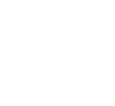
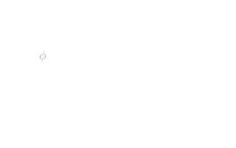
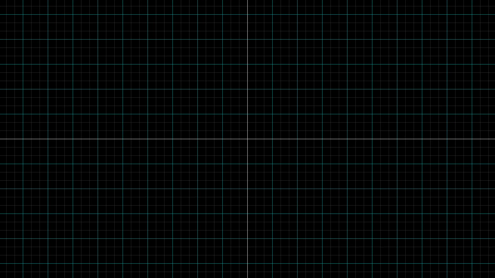
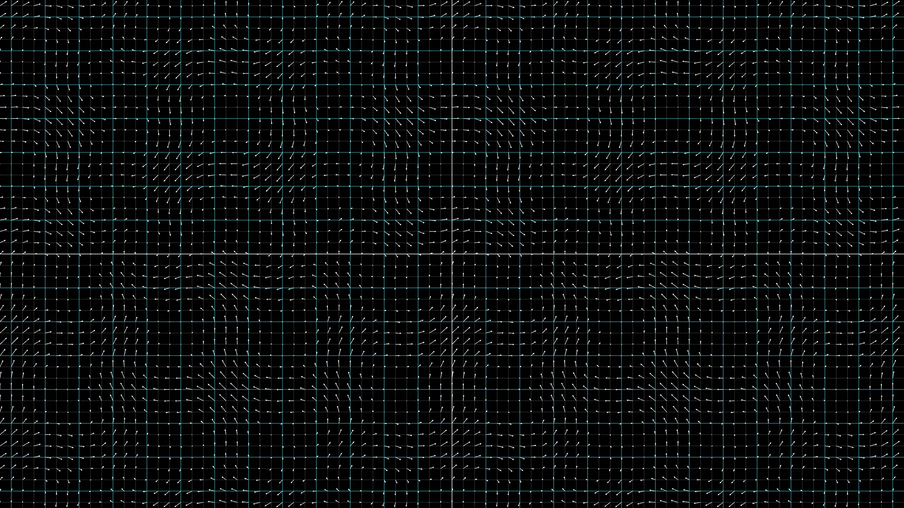
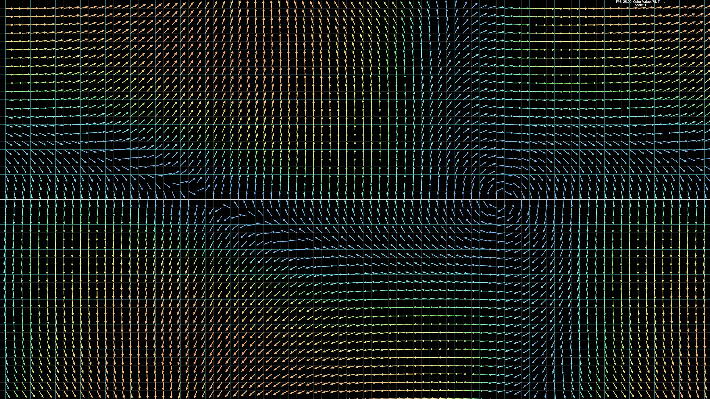

# Introduction

This section will cover chapters 1-3, as well as the building process of a vector field visualiser, in more particular a velocity and acceleration field simulator.
The first chapter has opened up with a brief overview of the electromagnetic course, which covers what electric and magnetic fields are and how they interact with matter,
bringing up important concepts such as superposition,

$$
    \vec{E} = \vec{E_1} + \vec{E_2}
$$

the Maxwell's equations,

$$
\begin{aligned}
    \vec{\nabla} \cdot \vec{E} &= \frac{\rho}{\epsilon_0} \\
    \vec{\nabla} \cdot \vec{B} &= 0 \\
    \vec{\nabla} \times \vec{E} &= - \frac{\partial \vec{B}}{\partial t} \\
    \vec{\nabla} \times \vec{B} &= \frac{\partial \vec{E}}{\partial t} + \frac{\vec{j}}{\epsilon_0}
\end{aligned}
$$

and some simple examples of electric effects.
However, before I dove into potentials and the Coulombs law, the concept of vector fields and vector calculus had to be explored.
Chapters 2 \& 3 have some great concepts of vector calculus. This includes the use of the Nabla ($\vec{\nabla}$) operator to acquire the gradient, divergence or curl of a field.
In addition, these chapters have covered important concepts such as flux, circulation and important characteristics of vectors.
Let me begin by summarising my findings and important concepts learnt in this chapter, in a way that is easier to understand.

# Nabla and its operations

First of all, what is a field? Well, a field is a representation of how values change as you move through space.
Fields can consist of either vectors or scalars, where at each point in space.
An example of a scalar field would be the temperature change, while a vector field could be for example the heat flow.

<div class="svg-container">
  
</div>

For scalar field, we can get the gradient at each point at this field, but instead of just getting the change only with respect to $x$, $y$ or $z$, we create a new vector:

$$
\left( \text{Derivative of T} \right) = \left( \frac{\partial T}{\partial x}, \frac{\partial T}{\partial y}, \frac{\partial T}{\partial z} \right)
$$

To avoid writing this partial derivative vector, a new operator is introduced,

$$
\vec{\nabla} = \left( \frac{\partial}{\partial x}, \frac{\partial}{\partial y}, \frac{\partial}{\partial z} \right)
$$

this operator can be applied onto scalar fields, to acquire same form as shown before.

$$
\text{grad}\, T = \vec{\nabla}T = \left( \frac{\partial T}{\partial x}, \frac{\partial T}{\partial y}, \frac{\partial T}{\partial z} \right)
$$

Now, lets talk about the two of most important concepts of this operator, the divergence and the curl.
These operators can be applied onto vector fields only.
The divergence is a scalar value that will tell us whether the current point is a source or a sink, in most real-life applications, matter and energy is conserved,
therefore the divergence would likely be 0. The curl on the other hand is a vector value, which tells us how much the field is literally curling.

$$
\begin{aligned}
\text{(divergence)} \, \vec{\nabla} \cdot \vec{A} &= \frac{\partial A_x}{\partial x} + \frac{\partial A_y}{\partial y} + \frac{\partial A_z}{\partial z} \\
\text{(curl)} \, \vec{\nabla} \times \vec{A} &= \det \begin{vmatrix}
\hat{i} & \hat{j} & \hat{k} \\
\nabla_x & \nabla_y & \nabla_z \\
A_x & A_y & A_z
\end{vmatrix}
\end{aligned}
$$

Since nabla is a vector operator, we can do all sorts of actions, with it. Common theorems and use cases are as shown here,

$$
\begin{aligned}
\vec{\nabla} \cdot (\vec{\nabla} \times \vec{A}) &= 0 \\
\vec{\nabla} \times \vec{\nabla} &= 0 \\
\vec{\nabla} \cdot \vec{\nabla} &= \nabla^2 = \frac{\partial^2}{\partial x^2} + \frac{\partial^2}{\partial y^2} + \frac{\partial^2}{\partial z^2}
\end{aligned}
$$

First equation stems from linear algebra, by using the definition of $\vec{A} \cdot (\vec{A} \times \vec{B}) = 0$,
since the cross product will give us a vector perpendicular to $\vec{A}$, therefore not sharing any component with $\vec{A}$.
Second equations comes from the fundamental definition of a cross product, where the two vectors cannot be parallel, therefore $\vec{A} \times \vec{A} = 0$.
Lastly, we can take the dot product of two vectors, which will give us a higher order derivative, but it is important to note that this is a scalar value.

By leveraging the first two equations, the following theorems can be made.

$$
\begin{aligned}
&\text{If} && \vec{\nabla} \cdot \vec{A} = 0 \\
&\text{there exists} && \vec{C} \\
&\text{s.t.} && \vec{\nabla} \times \vec{C} = \vec{A} \
\end{aligned}
\qquad \qquad
\begin{aligned}
&\text{If} && \vec{\nabla} \times \vec{A} = 0 \\
&\text{there exists} && \psi \\
&\text{s.t.} && \vec{\nabla} \psi = \vec{A}
\end{aligned}
$$

# Vector Calculus

After covering what we can do with differentials, it is time to move onto integrals and using these differentials inside of calculus.

For a scalar field $\phi(x,y,z)$, a line integral can be constructed to get the difference between two points, $A$ \& $B$.
This line integral steps through the line and at each small segment calculates the gradient of the scalar field at that particular point and then uses that to get the component that aligns with the direction of travel.

The integral along line $\Gamma$, from point A to B will be equal to the difference in the scalar field between those two points.
Any shape and position of the curve will lead to the same answer if the points remain unchanged.

$$
\int_{\Gamma} (\vec{\nabla}\phi) \cdot \vec{ds} = \phi(B) - \phi(A)
$$

<div class="svg-container">
  
</div>

Now lets talk about fluxes of vector fields, which means how much of some vector field is flowing out of the surface.
For that, we have to imagine a larger surface to be broken down into tiny squares, where for each square we compute how much the vector field aligns with its normal.

$$
\left(\text{Total flux outwards from S}\right) = \iint_S \vec{h} \cdot \hat{n} \, dA
$$

where $dA = dxdy$. In addition, in the lecture, $\vec{h}$ represents the heat flow, however here it is more of a generic vector field.
Then, we can show that this integral holds true, even when the surface has been split up into multiple pieces.
This drives us to make a connection that the whole surface can be broken down into many small cubes, where divergence gets used to simplify the equation, now rewritten as

$$
\iint_S \vec{h} \cdot \hat{n} \, dA = \iiint_V \vec{\nabla} \cdot \vec{h} \, dV
$$

This is the Gauss theorem and I was planning on integrating this into my projects, for example a Gauss theorem proof visualiser.

Lastly, I want to cover the Stokes theorem.
Imagine an enclosed loop, where our goal is to get the circulation around it.
For each tiny $\vec{ds}$ step we take, we have to get the component of the vector field tangent to the direction of travel, or in other words the dot product.

$$
\left(\text{Circulation around C}\right) = \oint_C \vec{h} \cdot \vec{ds}
$$

The tiny circle on the integral signifies that the surface is fully enclosed, emphasising that we are going around the loop.
Now, if we similarly break down this one giant loop into many small ones, we can make an observation that the curl of a vector field in each small loop will be equal to the circulation around.
This can be written as

$$
\oint_C \vec{h} \cdot \vec{ds} = \iint_S (\vec{\nabla} \times \vec{h}) \cdot \hat{n} \, dA
$$

where $\hat{n}$ is the normal of each little surface that was made.

# Project

## Outline

Since this is only the beginning, I wanted to lay foundation, to make something simple that can be expanded on later.
Therefore, I have chosen to make a simple vector field visualiser, where we have a grid, with arrows at each vertex, that points in the direction of the vector field and changes colours based on its magnitude.

My previous project involving physics and computer science was building a real-time ocean simulation in Rust by following the Tessendorf's model,
therefore I wanted to ground myself this time, and went with a simpler library, nannou. Although nannou is still based on wgpu, as the ocean, it provides a simple API to manipulate the scene on the CPU.

I have learnt my mistakes from previous projects and wanted to make sure each component of my project is modularized, where a single struct is responsible for a single thing.
Nannou works by having 3 main functions, `model`, `view` and `update`.
`Model` is responsible for initialising the window, initialising all the variables and assigning the view function for rendering. The `view` function is, as the name suggests, a function responsible for drawing objects
onto a frame. Meanwhile, the `update` function is called every draw call, which mutates the `Model` struct and progresses the simulation. One of the benefits of nannou that I found really convenient is how much
the application exposes, such as the simulation time, keyboard and mouse inputs, as well as having a really simple interface for drawing any object to the screen.

## Grid Generation

Lets begin by making a `Grid` struct, which will hold all the values linked to the grid, like the spacing and colors, along with methods for rendering and updating certain parameters. Inside the `model` function, `Grid::new()`
is called and stored inside the `Model` struct, which allows us to dynamically change the parameters of it, without recreating the object every time. Then, inside the `view` function, we call `model.grid.draw_grid(app, model, &draw)`.
This method uses the nannou provided lines first draw the main axis lines, as shown here, where `min_x` \& `max_x` represent the minimum and maximum x values extracted from the window metadata.

```rs
// x-axis
draw.line()
    .start(pt2(min_x, 0.0))
    .end(pt2(max_x, 0.0))
    .color(self.color_axis)
    .weight(1.5);
```

After the main axis are created, the main grid pattern can be generated, this is done by a simple for loop where a certain step is taken each time starting from the origin and stretching until the limit is reached.
In addition to normal grid lines, I wanted to implement highlighted grid lines, being inspired by 3Blue1Brown, which appear every `self.highlight_distance` amount of squares.

```rs
// Vertical lines
// Loop from first line distance, to the maximum x
for i in (self.line_distance..(max_x as usize)).step_by(self.line_distance) {
    // Get pure index
    let index = i / self.line_distance;
    // Color appropriately
    let color = if index.is_multiple_of(self.highlight_distnace) {
        self.color_highlight
    } else {
        self.color_grid
    };

    let x_coord = i as f32;
    // Draw first the line in the positive quadrant
    draw.line()
        .start(pt2(x_coord, min_y))
        .end(pt2(x_coord, max_y))
        .color(color)
        .weight(1.0);
    // Then repeat, but on opposite side, saves time.
    draw.line()
        .start(pt2(-x_coord, min_y))
        .end(pt2(-x_coord, max_y))
        .color(color)
        .weight(1.0);
}
```

If these two operations are mirrored for y and x axis respectively, then a consistent grid is generated, as shown here.

<div class="img-container">
  
</div>

## Vector Arrows

Now that the grid is generated, I wanted to draw vector at each intersection of the grid lines. For that, I will use the provided `draw.arrow()` function, which handles all complex rendering for me.
But, how does the vector know where the arrow should point? Ah! Well, I will have a `draw_vectors` function, responsible for iterating across each vertex, and theoretically I could hardcode a function that will
map coordinates $(x, y)$ onto a different position in space. This will indeed yield in a vector field, where at each point in space, an arrow is generated pointing the right direction. However, this can quickly
get cluttered easily, therefore I am switching to generics. Generics in Rust allow me to pass in a function `F: Fn(f32, f32) -> Point2`, which accepts the coordinates and outputs a vector (Point2 is closely related to Vec2, or in other words a 2 dimensional vector).
This allows me to move the `arrow_function`, which will determine how the field behaves, anywhere in the program, and just pass it in when needed.

```rs
// This is needed to make sure vectors are at the right positions
let start_x = (min_x / self.line_distance as f32).ceil() as i32 * self.line_distance as i32;
let start_y = (min_y / self.line_distance as f32).ceil() as i32 * self.line_distance as i32;

// Loop through each point
for x in (start_x..max_x as i32).step_by(self.line_distance) {
    for y in (start_y..max_y as i32).step_by(self.line_distance) {
        let x_f32 = x as f32;
        let y_f32 = y as f32;

        // Get current position
        let relative_origin = pt2(x_f32, y_f32);
        // Get the vector
        let vec = arrow_function(x_f32, y_f32);

        // Get the end point
        let end = relative_origin + vec;

        // Draw the arrow
        draw.arrow()
            .start(relative_origin)
            .end(end)
            .color(color::WHITE);
    }
}
```

In the future, this can be adapted to accept plain text inputs from
the user. This already will generate the following result.

<div class="img-container">
  
</div>

However, as you can see the arrows are really messy and with higher magnitude they will overlap each other. Therefore, we can normalise each of the vectors to a length of 1.

$$
\hat{v} = \frac{\vec{v}}{|\vec{v}|}
$$

This will shorten each vector to the same length, reducing the cluster.
However, now we have data that is being lost, the strength of the field is no longer being displayed.
Therefore, we will use color to represent the magnitude of each vector.
We can get the "strength" value by applying this formula,

$$
\left( \text{strength} \right) = \frac{|\vec{v}|}{|\vec{v}| + c_v}
$$

where $c_v$ is a special constant which defines the range of colors available. Afterwards we apply the `smoothstep` function, commonly seen in shaders,
to boost the contrast and make the transition look sharper by applying a special curve to the value. Afterwards, the value is clamped
between the minimum arrow scale and 1.0. After this is done, we can generate the color itself by using the `map_range` function in
addition to the `hsv` function, giving us this beautiful heatmap.

```rs
let len = vec.length();
let strength = len / (len + model.color_value);

let t = smoothstep(0.0, 1.0, strength);
let t_clamped = t.clamp(self.min_arrow_scale, 1.0);
let hue = map_range(t, 0.0, 1.0, 0.6, 0.0);
let color = hsv(hue, 0.8, 0.9);
```

this gives us the following arrows on the grid where each one has a magnitude of 1 and an appropriate color scale indicating the real magnitude.

<div class="img-container">
  
</div>

## Particles

To visualise these vector fields even further, we can simulate particles moving around this field. As complex as this may sound it is
actually quite simple. A new `Particle` struct is created which holds the data for the radius and other properties, along with its current position.
In the previously mentioned `Model` struct, we create a new `Vec` which will hold these particles, as they are added into the scene.
This allows to dynamically add and remove the particles. Now, in the `update` function, where we will have a check
if the left mouse button is pressed. If it is, then extract current location and insert a new particle into the `vec`, as shown here.

```rs
// Create a new particle with no velocity at the mouse location when left clicked.
if app.mouse.buttons.left().is_down() {
    let mouse_pos = pt2(app.mouse.x, app.mouse.y);
    let particle = Particle::new(
        DEFAULT_RADIUS,
        // Redish color
        nannou::color::srgba(1.0, 0.3, 0.1, 0.6),
        mouse_pos,
    );
    model.particles.push(particle);
}
```

This creates a stationary particle at the position of the mouse, however this doesn't display it. For that purpose,
inside the draw function, we loop through the whole `vec`, and for each particle we call its draw method. This draw method
just creates an ellipse at the specified location with correct parameters. Now, to make the particle actually move, we have
to update its position. A new `update` method will be created for the particle, which takes in the same `arrow_function` generic
parameter to match the vector lines, and uses that to calculate the velocity of the particle at each point in space.
This velocity is then multiplied by the `dt`, the small time step in time (which is thankfully calculated and provided by nannou),
which can then be applied directly on the position of the particle. This method is then called for each particle inside
the _main_ `update` function.

However, there has to be made a distinction between velocity and acceleration field. For the velocity field, the `arrow_function` tells
us directly the velocity of the particle, whereas in an acceleration field, the velocity is cumulative and has to be updated, by adding
on `acceleration * dt`, where the acceleration is acquired from the same `arrow_function`. The final update method is as shown here.

```rs
pub fn update_pos<F>(&mut self, app: &App, arrow_function: F)
where
    // x, y, t
    F: Fn(f32, f32, f32) -> Point2,
{
    let dt = app.duration.since_prev_update.as_secs_f32() * TIME_SCALE;
    // Added a switch between acceleration / velocity field.
    if FIELD_MODE == FieldMode::Acceleration {
        // Velocity is cumulative and differs by the acceleration
        let acceleration = arrow_function(self.position.x, self.position.y, app.time);
        self.velocity += acceleration * dt;
        self.position += self.velocity * dt;
    } else {
        // Velocity DIRECTLY correlates to the arrow function
        self.velocity = arrow_function(self.position.x, self.position.y, app.time);
        self.position += self.velocity * dt;
    }
}
```

Lastly, a new parameter has been added to the `arrow_function` - time. Time allows us to evolve the vector field through time,
making more interesting and complex visualisations. Here is a set of videos, showcasing the final velocity and vector fields.

<div class="vid-grid">
  <div class="vid-card">
    <div class="vid-shroud">
      <video autoplay muted loop playsinline src="https://static.konyogony.dev/vel-field-1.mp4"></video>
    </div>
    <label>Velocity Field 1</label>
  </div>
  <div class="vid-card">
    <div class="vid-shroud">
      <video autoplay muted loop playsinline src="https://static.konyogony.dev/vel-field-2.mp4"></video>
    </div>
    <label>Velocity Field 2</label>
  </div>
  <div class="vid-card">
    <div class="vid-shroud">
      <video autoplay muted loop playsinline src="https://static.konyogony.dev/vel-field-3.mp4"></video>
    </div>
    <label>Velocity Field 3</label>
  </div>
  <div class="vid-card">
    <div class="vid-shroud">
      <video autoplay muted loop playsinline src="https://static.konyogony.dev/acc-field-1.mp4"></video>
    </div>
    <label>Acceleration Field 1</label>
  </div>
</div>

# Observations & Conclusions

The mathematics of vector fields are really interesting, and the derivations of all the characteristics are quite intuitive.
I am looking forward to making more different visualisers and simulations that can prove various theories, like the Gauss theorem.
However, so far all the computations have been done on the CPU, which as seen in the videos, when many particles are created (for example, in a grid)
the FPS drop is huge and the simulation becomes unusable.
This is because we are not utilising the power of shaders parallelism on the GPU threads.
This immensely limits the amount of computations that can be done, and although nannou _does_ expose the plain wgpu API, allowing for shaders and such,
I have decided that my next goal will be to apply the power of rust onto shaders using [`rust-gpu`](https://rust-gpu.github.io/),
and by building up the application from scratch.

In short, the nannou demo has proven successful, being able to showcase small-scale experiments
with simpler vector fields and particles moving along them. However, to create more interesting and complex mechanics,
a different approach has to be taken.
